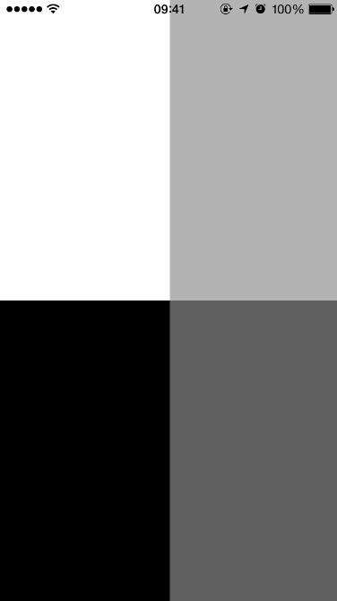

# TweaksPresentation

Small library based on Facebook's [Tweaks](http://github.com/facebook/Tweaks/) for improving screen sharing, presentations and recording by showing customizable touches on the screen.



## Usage

Easiest way is to use `TPPresentationTweakShakeWindow` as your main UIWindow subclass. It's a subclass of Tweaks' `FBTweakShakeWindow` with support for TweaksPresentation.

If you're using Storyboards implement `window` getter in your `AppDelegate` class.

```objc
- (UIWindow *)window
{
    if (!_window) {
        _window = [[TPPresentationTweakShakeWindow alloc] initWithFrame:[[UIScreen mainScreen] bounds]];
    }
    
    return _window;
}

```

You can similarly create new window with `TPPresentationTweakShakeWindow` class in `- (BOOL)application:(UIApplication *)application didFinishLaunchingWithOptions:(NSDictionary *)launchOptions` if you're not using Storyboards.

### Custom UIWindow subclass

If you're not using Tweaks' shake window, just use `TPFingerPresenter` class directly:

```objc
self.fingerPresenter = [[TPFingerPresenter alloc] initWithWindow:self.window];
```

## Licensing

TweaksPresentation is released under the MIT license. Go read the LICENSE file for more information.